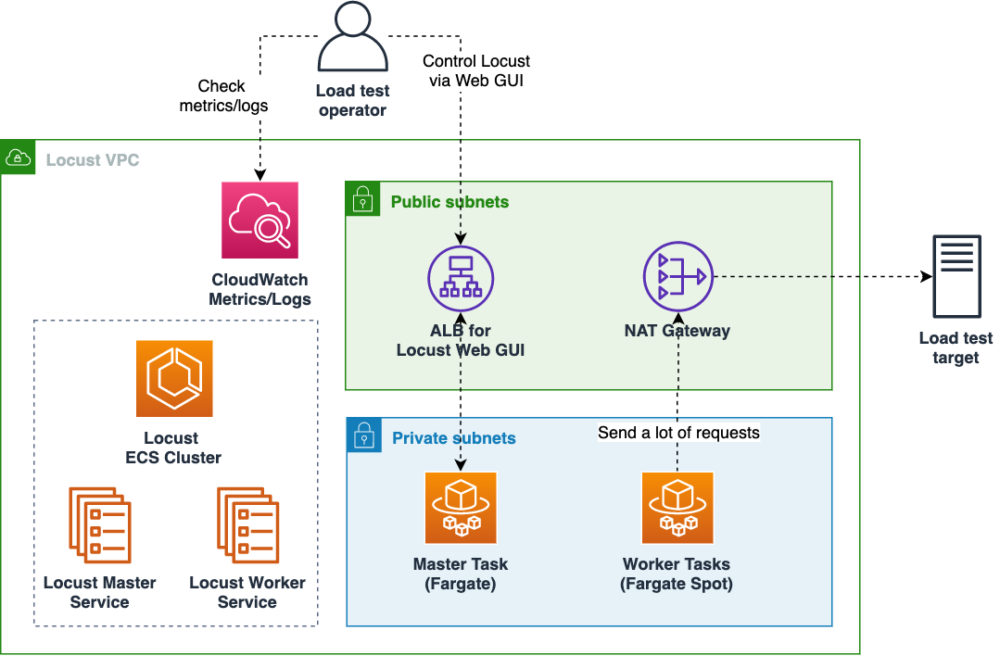
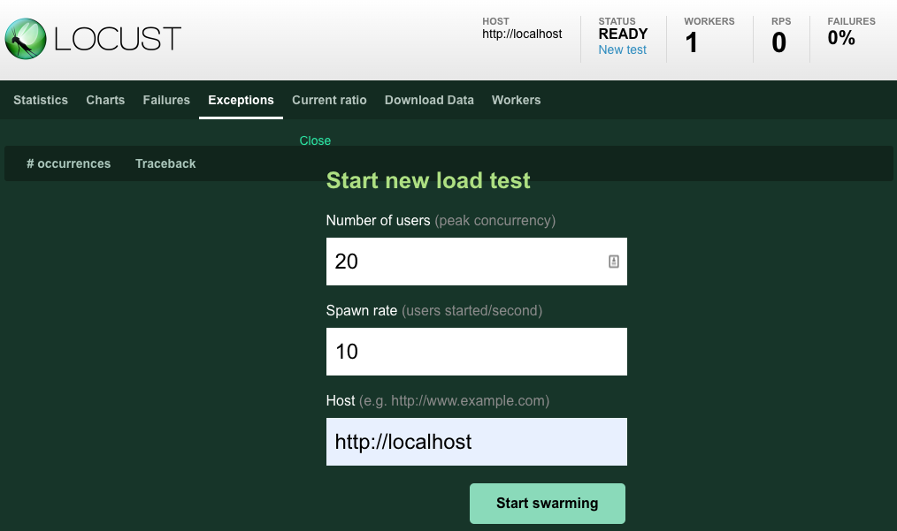

# Distributed Load Testing with Locust on Amazon ECS
[](https://github.com/aws-samples/distributed-load-testing-with-locust-on-ecs/actions/workflows/build.yml)

This sample shows you how to deploy [Locust](https://locust.io/), a modern load testing framework, to Amazon Elastic Container Service (ECS). It leverages a serverless compute engine [Fargate](https://aws.amazon.com/fargate/) with spot capacity, which allows you to run massive-scale load test without managing infrastructure and with relatively low cost (70% cheaper than using on-demand capacity).

## How it works
Below is the architecture diagram of this sample.



We deploy Locust with distributed mode, so there are two ECS services, master service and worker service.

The number of  Locust master instance is always one, and it can be accessed via Application Load Balancer.

On the other hand, there can be *N* Locust worker instances, which is usually the dominant factor of load test infrastructure cost.
We use Fargate spot capacity for worker instances, which allows you to run load test at most 70% cheaper than on-demand capacity.

Note that all the access from Locust workers go through NAT Gateway, which makes it easy to restrict access by IP addresses on load test target servers, because all the Locust workers shares the same outbound IP address among them.

## Deploy
To deploy this sample to your own AWS account, please follow the steps below.

### 1. Prerequisites
Before you deploy, make sure you install the following tools in your local environment.

* Docker
* Node.js (v14 or newer)
* AWS CLI

Also you need Administorator IAM policy to deploy this sample.

### 2. Set parameters
Before deploy, you need to set some parameters.

Please open [bin/load_test.ts](./bin/load_test.ts) and find property named `allowedCidrs`.
This property specifies the CIDRs which can access the Locust web UI ALB.
You should set this as narrrow as possible because otherwise unwanted users can access your Locust control panel.

To change the AWS region to deploy this samples to, please replace `us-west-2` in `env.region` property to your desired region.

For additional security, you can set `certificateArn` and `env.account` to protect ALB with TLS.
By default Locust Web GUI can be accessed with HTTP. You can make it HTTPS by those properties.

You can also enable basic authentication for Locust web UI by specifying `webUsername` and `webPassword` properties.

### 3. Setup CDK
After confirming the parameters, you can proceed to CDK deployment.

First, you need to setup CDK environment by the following command:

```sh
npm ci
npx cdk bootstrap
```

You only need those commands once for your AWS environment (pair of account ID and region.)

### 5. Run cdk deploy
Now you can deploy your CDK project.

```sh
npx cdk deploy
```

Deployment usually takes less than 10 minutes.

After a successful deployment, you can find some stack outputs like below in your terminal:

```
 ✅  LoadTestStack

✨  Deployment time: 109.55s

Outputs:
LoadTestStack.EcsClusterArn = arn:aws:ecs:ap-northeast-1:123456789012:cluster/LoadTestStack-ClusterEB0386A7-xxxxxx
LoadTestStack.MasterServiceLoadBalancerDNSD23C49A7 = LoadT-Maste-1MZQ6IPOOJ262-xxxxxxx.ap-northeast-1.elb.amazonaws.com
LoadTestStack.MasterServiceServiceURL66A06FCF = http://LoadT-Maste-1MZQ6IPOOJ262-xxxxxxx.ap-northeast-1.elb.amazonaws.com
LoadTestStack.WorkerServiceName = LoadTestStack-WorkerService3F60922A-xxxxxxx
```

You need the value of `EcsClusterArn` and `WorkerServiceName` in later steps, so it is recommended that you take a note of those values.

After that, please make sure that you can open the URL in `LocustMasterServiceURLCA3E9210` and view Locust Web GUI like below image.



Now the deployment is completed! You can start to use Locust load tester.

## Tips
There are a few things you need to know to use this sample effectively.

### Adjust the number of Locust worker tasks
According to the amount of load you want to generate, you may need to increase Locust workers.

It can be done with the following command:

```sh
aws ecs update-service --cluster <EcsClusterArn> --service <WorkerServiceName> --desired-count <the number of workers>
```

Please replace `<EcsClusterArn>` and `<WorkerServiceName>` with the value you took a note when deployment, and `<the number of workers>` with any integer you desire for the worker count.

Please also be aware that your default quota for the number of Fargate tasks is 1000.
If you need more tasks, you can request a limit increase from [Service Quotas console](https://console.aws.amazon.com/servicequotas/home). You can read further detail [here](https://docs.aws.amazon.com/general/latest/gr/aws_service_limits.html).

### When Fargate spot is out of capacity
It is expected that sometimes Fargate spot fails to run your Locust workers because of insufficient capacity.
If such situation continues for unacceptable time, you can add on-demand instances to fill your desired task count.

Please open [`lib/constructs/locust_worker_service.ts`](lib/constructs/locust_worker_service.ts) and find the lines below:

```ts
      capacityProviderStrategies: [
        {
          capacityProvider: 'FARGATE_SPOT',
          weight: 1,
        },
        {
          capacityProvider: 'FARGATE',
          weight: 0,
        },
      ],
```

You can specify the ratio of spot vs on-demand by `weight` property. The default is to use spot 100%.

### Modify Locust scenario
Default locustfile is placed on [`./app/locustfile.py`](app/locustfile.py).

You can modify this file as you like. To deploy your change, run `cdk deploy` again.

Also, you can build and run Locust locally by the following commands:

```sh
cd app
docker build . -t locust
docker run -p 8089:8089 locust 
```

## Clean up
To avoid incurring future charges, clean up the resources you created.

You can remove all the AWS resources deployed by this sample running the following command:

```sh
npx cdk destroy --force
```

## Security

See [CONTRIBUTING](CONTRIBUTING.md#security-issue-notifications) for more information.

## License

This library is licensed under the MIT-0 License. See the LICENSE file.
